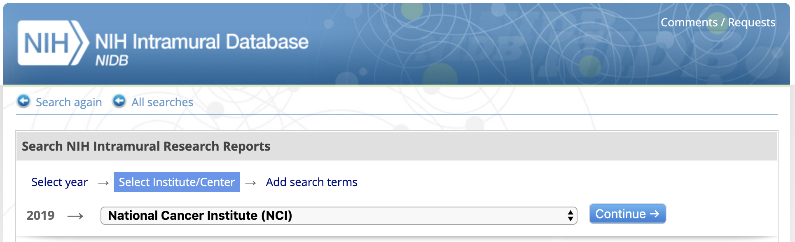
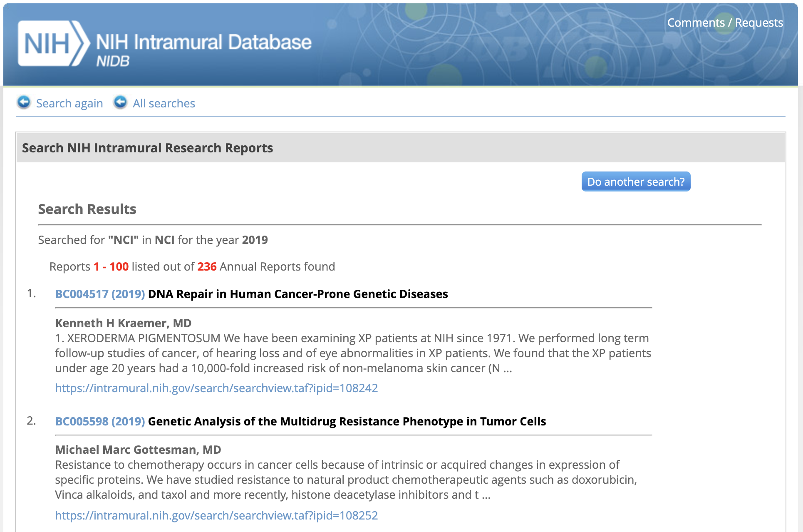
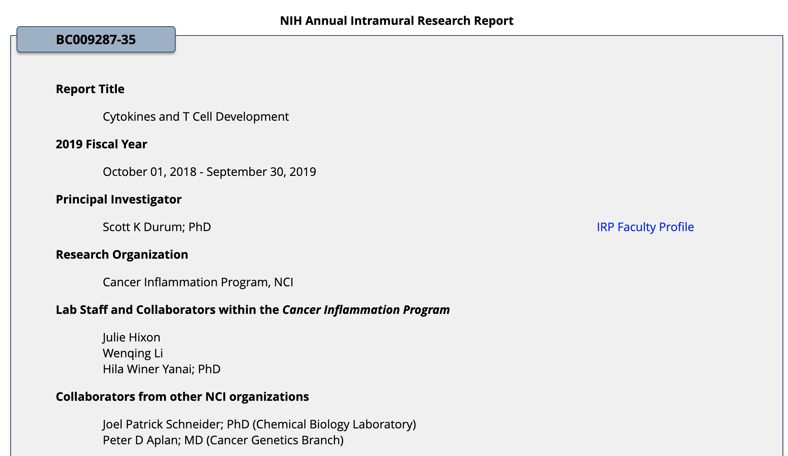

# NIH-Intramural-Database
Pull annual project reports from any NIH Institute from 1999 - 2019 using Selenium 

## Usage
The script will navigate to [the NIH Intramural Database](https://intramural.nih.gov/search/search.taf), shown here

After inputting the required search terms, the results will appear:

The script will programatically open each unique project link and extract all fields in bold.

Results are exported as a single CSV file for a given search (by institute, by year)

To run the script, execute the following: (must have Python 3.7 installed in environment)
```
$ python3 mine_nidb.py
```
Follow instruction prompts via command line to select specific institute and year 

### Installation
Must have Selenium Chrome Driver installed, along with the corresponding version of Chrome. 

### Update 5/13/20
The UI for the NIH Intramural Database has been updated since development (Fall 2019), so all features may *not* be working as expected.
